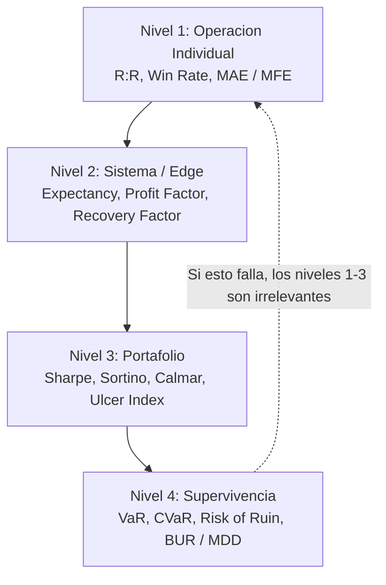
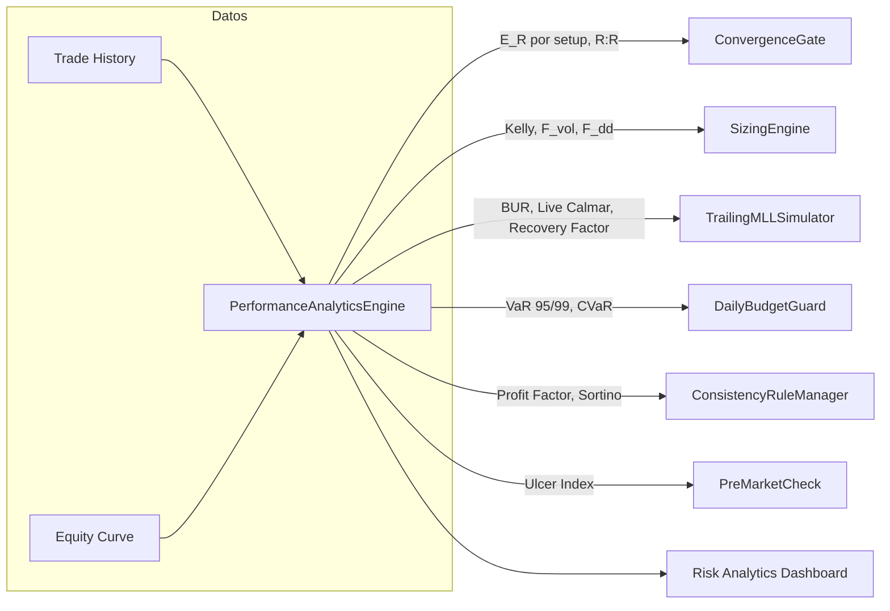

# Funding Mode v2.0 — Anexo de Métricas de Riesgo Profesional
## Estándares Cuantitativos Institucionales Adaptados al Sistema de Evaluación de Prop Firms

---

## 0. Propósito de este Anexo

Este documento complementa el plan **Funding Mode v2.0** y las modificaciones ya incorporadas (Filtro de Spread, Time Stop, Sizing Asimétrico, Factor Humano, restricción 0DTE en evaluación). Su objetivo es traer al sistema el **marco de métricas que usan los desks institucionales y los CTAs** para medir, monitorear y validar el edge estadístico de una estrategia — no como adorno académico, sino como **gates operativos** dentro de los componentes que ya definieron: `ConvergenceGate`, `SizingEngine`, `TrailingMLLSimulator`, `DailyBudgetGuard`, `ConsistencyRuleManager` y `PreMarketCheck`.

La premisa central: **pasar la evaluación es un subproducto de tener un sistema con expectativa matemática positiva, riesgo de ruina bajo y drawdown controlado — no al revés.** Las métricas de esta sección son la forma de demostrar (a uno mismo y, numéricamente, al sistema) que esa premisa se cumple antes de arriesgar capital real o de la firma.

---

## 1. Jerarquía de Métricas de Riesgo

Las métricas no son intercambiables: viven en cuatro niveles, y un sistema puede verse excelente en un nivel y ser letal en otro. Esto es exactamente lo que ocurre con estrategias de venta de prima / 0DTE: Win Rate altísimo (Nivel 1) conviviendo con Risk of Ruin alto (Nivel 4).



La regla práctica: **el Nivel 4 manda**. Un Profit Factor de 2.5 con un Risk of Ruin de 15% no es un buen sistema para fondeo — es una moneda al aire con buena propaganda. El diseño que sigue está ordenado de abajo hacia arriba en importancia para el `ConvergenceGate` y el `SizingEngine`, aunque se presenta de Nivel 1 a Nivel 4 por claridad pedagógica.

---

## 2. Nivel 1 — Métricas de Operación Individual

### 2.1 Relación Riesgo-Recompensa (R:R / RRR)

**Definición:** distancia al objetivo de beneficio dividida por la distancia al stop loss, expresada en R (1R = el riesgo definido de la operación).

```
R:R = |Distancia al Take Profit| / |Distancia al Stop Loss|
```

Lo que vuelve esta métrica útil no es su valor aislado, sino su relación con el **Win Rate de equilibrio** — el porcentaje de aciertos mínimo para no perder dinero:

```
Win Rate de equilibrio = 1 / (1 + R:R)
```

| R:R | Win Rate de Equilibrio |
|---|---|
| 0.5 : 1 | 66.7% |
| 1 : 1 | 50.0% |
| 1.5 : 1 | 40.0% |
| 2 : 1 | 33.3% |
| 3 : 1 | 25.0% |

**Adaptación al sistema:** dado que el umbral de convergencia (0.82) implica señales escasas y de alta confianza, cada señal debe "pesar" más. Recomiendo que el `ConvergenceGate` incorpore un **R:R mínimo duro (≥ 1.5)** como condición necesaria — no suficiente — antes de evaluar convergencia. Una señal con convergencia 0.90 pero R:R de 0.8 sigue siendo matemáticamente mediocre.

### 2.2 Win Rate (Tasa de Acierto)

Aislado, el Win Rate **no significa nada**. Un sistema con 90% de aciertos y R:R de 0.15 (típico de venta de prima corta sin cobertura) tiene peor expectativa que uno con 35% de aciertos y R:R de 3. Su único uso legítimo es como insumo de Expectancy y de Kelly (secciones 3.1 y 6.1).

### 2.3 MAE / MFE — Calibración del Time Stop

Dos métricas de microestructura del trade que Wall Street usa para optimizar salidas:

- **MAE (Maximum Adverse Excursion):** cuánto se mueve el precio en contra antes de que el trade se resuelva.
- **MFE (Maximum Favorable Excursion):** cuánto se mueve a favor antes de resolverse.

**Adaptación directa a la modificación de Gemini ("Time Stop — cierre forzado si no avanzó 0.5R en X minutos"):** en lugar de fijar "0.5R" y "X minutos" arbitrariamente, corran un análisis de MFE sobre el histórico de trades ganadores, segmentado por tipo de señal (VPIN, OFI, GEX). Si el percentil 25 de "tiempo hasta alcanzar 0.5R de MFE" para los trades que terminan ganadores es, digamos, 4 minutos, ese es el valor empírico de X — no una corazonada. Esto convierte el Time Stop en una regla derivada de datos, no de intuición.

---

## 3. Nivel 2 — Métricas de Sistema (Edge Estadístico)

### 3.1 Expectativa Matemática (Expectancy) — la métrica madre

```
E[R] = (WinRate × AvgWinR) − (LossRate × AvgLossR)
```

Es el valor esperado, en múltiplos de R, de **cada** operación a largo plazo. Todo lo demás (Profit Factor, Sharpe, Calmar) es una transformación o reescalado de esta idea base.

**Ejemplo de referencia** (lo voy a reusar en todo el documento para que las secciones converjan):

```
WinRate = 40%   |   R:R = 2   |   AvgWinR = 2   |   AvgLossR = 1
E[R] = (0.40 × 2) − (0.60 × 1) = 0.80 − 0.60 = 0.20R por operación
```

**Estándar profesional:** sistemas sistemáticos institucionales suelen operar en el rango de **0.15R–0.35R de expectativa promedio**, con frecuencia suficiente para que la ley de los grandes números haga su trabajo. Van Tharp formaliza esto como **"Expectunity" = Expectancy × Oportunidades por período** — relevante acá porque el umbral de convergencia 0.82 reduce drásticamente las "oportunidades", así que el `E[R]` por trade necesita estar en la parte alta del rango para compensar.

**Punto crítico — Expectancy estratificada:** con un motor que dispara señales desde VPIN, OFI y cadenas GEX, **calcular un único Expectancy agregado es un error de Simpson**. Es perfectamente posible que el agregado sea 0.20R mientras una de las tres familias de señales tiene Expectancy negativo y está siendo subsidiada por las otras dos. El `ConvergenceGate` debería trackear `E[R]` **por tipo de setup**, no solo global, y poder desactivar individualmente una familia de señales si su `E[R]` rolling cae por debajo de cero.

**Adaptación — "Expectancy Gate":** antes de que una señal pase a ejecución en fase Funded, el `ConvergenceGate` valida que el `E[R]` rolling (últimas N señales de ese mismo tipo de setup) supere el umbral de fase (ver tabla de la sección 9).

### 3.2 Factor de Beneficio (Profit Factor)

```
PF = Beneficio Bruto Total / |Pérdida Bruta Total|
```

| Rango de PF | Interpretación |
|---|---|
| < 1.0 | Sistema perdedor |
| 1.0 – 1.3 | Marginal — comisiones y slippage pueden devorar el edge |
| 1.3 – 1.7 | Robusto, típico de mesas institucionales sistemáticas |
| 1.7 – 2.5 | Muy bueno |
| > 3.0 | Sospechoso de overfitting en backtest — rara vez sobrevive en vivo |

Un PF "demasiado bueno" en backtest es **señal de alarma**, no de éxito — particularmente relevante dado que el documento original menciona un umbral de convergencia muy ajustado (0.82), terreno fértil para overfitting por curve-fitting del threshold.

**Adaptación:** `ConsistencyRuleManager` debería trackear PF rolling (ventana de 20 trades) además de la regla del 50%. Una caída abrupta de PF rolling es un proxy temprano de cambio de régimen de mercado, antes de que la regla de consistencia siquiera se vea amenazada.

### 3.3 Recovery Factor

```
RF = Beneficio Neto / |Max Drawdown|
```

Mide cuán eficientemente el sistema recupera terreno perdido. **Benchmark: RF > 2** se considera saludable. Un RF bajo con PF alto típicamente indica que el sistema gana de a poco y pierde de a mucho en eventos puntuales — exactamente el perfil de riesgo que el Gamma Flip puede generar en 0DTE.

---

## 4. Nivel 3 — Retorno Ajustado al Riesgo (Portafolio)

### 4.1 Sharpe Ratio

```
Sharpe = (Rp − Rf) / σp        (anualizado: × sqrt(periodos por año))
```

| Sharpe | Interpretación (estándar institucional) |
|---|---|
| < 1 | Subóptimo para un fondo institucional |
| 1 – 2 | Bueno — aceptable para la mayoría de hedge funds |
| 2 – 3 | Muy bueno — top quartile |
| > 3 | Excepcional — Renaissance Medallion históricamente reportó valores en este rango, pero son outliers casi irreplicables sin el apalancamiento y la escala de ese fondo |

**Limitación clave:** el Sharpe penaliza por igual la volatilidad al alza y a la baja. Para una estrategia con sesgo positivo (ej. compra de opciones con riesgo definido, donde las pérdidas están acotadas pero las ganancias no), el Sharpe **subestima** la calidad real del sistema. Por eso necesitan el siguiente.

### 4.2 Sortino Ratio

```
Sortino = (Rp − MAR) / σd      (σd = desviación estándar SOLO de retornos por debajo del MAR)
```

Donde MAR (Minimum Acceptable Return) suele ser 0.

**Por qué importa específicamente acá:** comparar Sharpe vs. Sortino del mismo stream de retornos revela el **perfil de skew** de la estrategia activa en ese momento:

- `Sortino >> Sharpe` → sesgo positivo (ej. setups de compra de opciones con riesgo definido). Bien.
- `Sortino ≈ Sharpe` → retornos aproximadamente simétricos.
- `Sortino << Sharpe` (raro, pero posible si hay pocos días muy malos) → sesgo negativo — típico de venta de prima corta / 0DTE sin cobertura.

**Adaptación:** el `SizingEngine` puede usar la relación Sortino/Sharpe como un "indicador de régimen de skew" — si el ratio cae por debajo de 1 de forma sostenida, es una señal de que el mix de setups activos se está volviendo de cola negativa, y el sizing debería volverse más conservador independientemente de lo que diga el Expectancy agregado (que puede tardar más en reaccionar).

### 4.3 Calmar Ratio (y MAR Ratio)

```
Calmar = CAGR / |Max Drawdown|        (ventana móvil típica: 36 meses; MAR Ratio usa el MDD histórico total)
```

| Calmar | Interpretación |
|---|---|
| < 0.5 | Débil |
| 0.5 – 1.0 | Aceptable |
| 1.0 – 2.0 | Bueno |
| 2.0 – 3.0+ | Excelente — rango de CTAs top tier (ej. Winton, AHL históricamente operan en este orden) |

**Esta es, con diferencia, la métrica más alineada con la estructura de una prop firm**, porque las prop firms literalmente diseñan su negocio alrededor de un techo de drawdown (el MLL). El Calmar responde exactamente a la pregunta que le importa a la firma: *"¿cuánto retorno generás por cada unidad de drawdown que consumís?"*

**Adaptación — "Live Calmar":** el `TrailingMLLSimulator` debería calcular en tiempo real:

```
Live Calmar = P&L Acumulado / Drawdown Actual desde el Pico (trailing)
```

Este número, mostrado de forma prominente en el dashboard, es el indicador de "salud de la cuenta" más honesto que existe — más útil que ver el P&L o el Buffer por separado.

---

## 5. Nivel 4 — Drawdown, Cola y Supervivencia

### 5.1 Maximum Drawdown (MDD) → Buffer Utilization Ratio (BUR)

```
MDD = max [ (Pico_t − Equity_t) / Pico_t ]   para todo t
```

Fondos multiestrategia grandes suelen limitar el MDD anual a 10–15%; los CTAs aceptan 15–25% dado su perfil de retorno objetivo más alto.

**Pero en el contexto de fondeo, el MDD no es un objetivo blando — es un kill switch (el MLL).** Por eso propongo reemplazar la noción difusa de "Buffer/MLL" por una métrica formal con zonas de acción:

```
BUR (Buffer Utilization Ratio) = Drawdown Actual desde el Pico / MLL
```

| Zona | BUR | Acción del SizingEngine |
|---|---|---|
| Verde | < 30% | Sizing normal |
| Amarillo | 30% – 60% | `F_dd estructural` = 0.7 (ver sección 6.2) |
| Rojo | ≥ 60% | `F_dd estructural` = 0.4, posible pausa para revisión manual |

### 5.2 Ulcer Index (UI) y Ulcer Performance Index (UPI)

```
UI = sqrt( (1/n) × Σ DDᵢ² )      DDᵢ = % de drawdown desde el pico móvil en el punto i
UPI (Martin Ratio) = (CAGR − Rf) / UI
```

A diferencia del MDD (que solo mira el peor punto), el Ulcer Index captura **profundidad Y duración** de todos los drawdowns — es, literalmente, una métrica de "cuánto malestar psicológico produjo el camino", no solo el destino.

**Adaptación directa al "Factor Humano (Biometrics/Fatiga)" de Gemini:** un drawdown profundo pero corto (UI bajo, MDD alto) es psicológicamente distinto de uno moderado pero prolongado (UI alto, MDD moderado) — y el segundo es el que históricamente rompe la disciplina de un operador, incluso si durmió bien y entrenó el domingo. Sugiero que `PreMarketCheck` incorpore el UI rolling como **override automático**: si UI rolling (50 trades) supera un umbral, fuerza reducción de tamaño *independientemente* de lo que reporte el chequeo biométrico manual. El sistema cuantitativo protege al operador de su propio optimismo.

### 5.3 Value at Risk (VaR) y Conditional VaR (CVaR / Expected Shortfall)

```
VaR 95% = percentil 5 de la distribución histórica de retornos diarios
CVaR 95% = pérdida promedio CONDICIONADA a estar en ese 5% peor   (Expected Shortfall)
```

Tres métodos, de menor a mayor sofisticación:

1. **Histórico:** usa la distribución empírica directamente. Simple, pero requiere suficiente historia.
2. **Paramétrico:** asume normalidad. **Peligroso para opciones** — la distribución de P&L de un libro de opciones (especialmente 0DTE corto) tiene colas mucho más gordas que una normal.
3. **Monte Carlo:** simula trayectorias considerando la dinámica de las Greeks. Es el método recomendado dado que ya tienen el motor de Gamma/GEX corriendo.

**Por qué CVaR > VaR para este sistema específico:** el VaR responde "¿cuál es la pérdida que no debería superarse el 95% de los días?" — pero **no dice nada sobre qué tan mal puede ser ese 5% restante**. En un escenario de Gamma Flip adverso (el que menciona el documento original como riesgo de los viernes 0DTE), la pérdida puede ser un múltiplo del VaR. El CVaR sí captura esto: es el promedio de esas colas.

**Adaptación al `DailyBudgetGuard`:**

```
DLL_efectivo = min( DLL_de_la_prop_firm , CVaR_99% × 1.67 )
```

Es decir, el límite diario operativo del sistema debería ser tal que el **CVaR del 99%** (la pérdida promedio en el 1% de peores días) no exceda el ~60% del DLL real de la firma — dejando un 40% de margen para "lo desconocido desconocido" (gaps, halts, fallas de ejecución).

### 5.4 Riesgo de Ruina (Risk of Ruin)

Forma clásica para apuestas de paga pareja (b=1):

```
RoR = ((1 − A) / (1 + A))^N        A = edge = 2×WinRate − 1,   N = capital / tamaño_de_apuesta (en unidades)
```

Para R:R asimétrico y reglas de sizing realistas, no hay fórmula cerrada práctica — el método profesional es **simulación Monte Carlo**: correr miles de secuencias de trades usando el (WinRate, distribución de R:R, regla de sizing) reales del sistema, y medir qué porcentaje de trayectorias toca un umbral de ruina.

**Adaptación crítica — redefinir "ruina" para fondeo:** en este contexto, ruina **no es perder el 100% del capital**. Ruina es **tocar el MLL** (terminación de la cuenta). Por lo tanto:

```
RoR_funding = % de trayectorias simuladas (N trades, con la lógica real del SizingEngine)
              que tocan el MLL ANTES de alcanzar el objetivo de profit
```

Esta es, posiblemente, **la métrica de go/no-go más importante de todo el sistema** — más que el Profit Factor del backtest, porque responde directamente "¿cuál es la probabilidad de que esta configuración específica sobreviva la evaluación?". Ver protocolo completo en la sección 10.

---

## 6. Sizing Cuantitativo (SizingEngine)

### 6.1 Criterio de Kelly y Kelly Fraccionado

```
f* = p − (1−p)/b = (b·p − q) / b        b = R:R,  p = WinRate,  q = 1−p
```

Con el ejemplo de la sección 3.1 (`p=0.40, b=2`):

```
f* = 0.40 − 0.60/2 = 0.40 − 0.30 = 0.10   →   10% del capital por trade (Kelly completo)
```

**El Kelly completo maximiza el crecimiento geométrico, pero implica una volatilidad enorme** — drawdowns del 50%+ son estadísticamente *normales* para un sistema con Kelly positivo operado a tamaño completo, incluso siendo matemáticamente "correcto". La práctica estándar:

| Fracción de Kelly | Reducción de volatilidad vs. Kelly completo | Reducción de tasa de crecimiento |
|---|---|---|
| 100% (completo) | — | — |
| 50% (Half-Kelly) | ≈ 75% | ≈ 25% |
| 25% (Quarter-Kelly) | ≈ 94% | ≈ 44% |

Para un contexto con techo de drawdown duro (MLL), incluso Half-Kelly suele ser excesivo. **Recomiendo 10%–25% de Kelly como unidad base de sizing**, dejando el resto del "presupuesto de Kelly" como colchón contra la volatilidad inherente a un sistema de expectativa positiva.

### 6.2 Modelo de Sizing Multi-Factor (formalizando las modificaciones de Gemini)

```
Tamaño de Posición = Equity × Kelly_base × F_vol × F_dd × F_signal
```

**`Kelly_base`** — 0.10 a 0.25 × Kelly completo, recalculado periódicamente (rolling WinRate y R:R por tipo de setup).

**`F_vol` (Factor de Volatilidad, ATR-based):**
```
F_vol = ATR_objetivo / ATR_actual      (clampeado, ej. entre 0.5 y 1.5)
```
Normaliza el riesgo en $ entre regímenes de volatilidad — estándar institucional.

**`F_dd` (Factor de Drawdown) — dos capas que conviven:**

La sugerencia de Gemini ("penalizador del 30% tras una pérdida") es excelente como **capa táctica de reacción rápida**, pero conviene combinarla con una **capa estructural** basada en el BUR (sección 5.1), que reacciona más lento pero refleja la salud global de la cuenta:

```
F_dd = F_dd_estructural (BUR)  ×  F_dd_táctico (racha reciente)
```

| Capa | Condición | Factor |
|---|---|---|
| Estructural | BUR < 30% | 1.0 |
| Estructural | 30% ≤ BUR < 60% | 0.7 |
| Estructural | BUR ≥ 60% | 0.4 |
| Táctico | Trade anterior ganador | 1.0 |
| Táctico | Trade anterior perdedor | 0.7 *(propuesta original de Gemini)* |
| Táctico | 2 pérdidas consecutivas | 0.5 |

**`F_signal` (Factor de Confianza de Señal):** mapeo lineal del score de convergencia (rango 0.82–1.00 según Regla 11 del plan original) a un multiplicador, ej. [0.7, 1.0]. Una señal con convergencia 0.95 opera con tamaño mayor que una en el límite (0.83) — el sizing refleja la confianza de la señal, no solo si pasó o no el filtro binario.

---

## 7. Tabla Maestra de Integración



| Componente existente | Métricas profesionales integradas | Implementación |
|---|---|---|
| `ConvergenceGate` | R:R mínimo (≥1.5), Expectancy Gate **por tipo de setup** | Bloquea señales que no cumplan ambos, además del filtro de spread |
| `SizingEngine` | Kelly fraccionado (10–25%), F_vol (ATR), F_dd (BUR + racha) | Modelo multi-factor de la sección 6.2 |
| `TrailingMLLSimulator` | BUR con 3 zonas, Live Calmar Ratio, Recovery Factor | Reemplaza "Buffer/MLL" simple por BUR accionable |
| `DailyBudgetGuard` | VaR 95/99% diario, CVaR 99% diario | `DLL_efectivo = min(DLL_firma, CVaR_99% × 1.67)` |
| `ConsistencyRuleManager` | Profit Factor rolling, Sortino rolling | Detección temprana de cambio de régimen, antes de violar la regla del 50% |
| `PreMarketCheck` | Ulcer Index rolling | Override automático de sizing, complementa el chequeo biométrico |
| **Nuevo:** `PerformanceAnalyticsEngine` | Todas las anteriores, en tiempo real | Sección 8 |
| **Nuevo:** Risk Analytics Dashboard | Visualización de todo lo anterior | Extiende sección 11.1 (glassmorphism / dark mode) |

---

## 8. Nuevo Componente: `PerformanceAnalyticsEngine`

Contrato de datos para el dashboard (Next.js / React):

```typescript
export interface RiskMetricsSnapshot {
  timestamp: string;
  windowSize: number;

  // Nivel 2 - Sistema (idealmente, un objeto por tipo de setup + uno agregado)
  expectancyR: number;
  profitFactor: number;
  recoveryFactor: number;
  winRate: number;

  // Nivel 3 - Portafolio
  sharpeRatio: number;
  sortinoRatio: number;
  calmarRatio: number;

  // Nivel 4 - Drawdown / Cola
  bufferUtilizationRatio: number;   // BUR: 0.0 - 1.0+
  ulcerIndex: number;
  var95Daily: number;
  cvar95Daily: number;
  cvar99Daily: number;
  riskOfRuinPct: number;

  // Sizing
  kellyFractionFull: number;
  kellyFractionApplied: number;     // tras F_vol, F_dd, F_signal
}
```

Motor de cálculo (esqueleto Python — el lenguaje natural para el pipeline cuantitativo, independiente de si corre como microservicio junto al motor C++/CUDA):

```python
import numpy as np
import pandas as pd

class PerformanceAnalyticsEngine:
    """
    trades: DataFrame con columnas ['r_multiple', 'pnl', 'setup_type', 'timestamp']
    equity_curve: Serie temporal del equity de la cuenta
    """

    def __init__(self, trades: pd.DataFrame, equity_curve: pd.Series, periods_per_year: int = 252):
        self.trades = trades
        self.equity = equity_curve
        self.periods_per_year = periods_per_year

    # --- Nivel 2: Sistema ---
    def expectancy_r(self, window: int = 20, setup_type: str | None = None) -> float:
        df = self.trades if setup_type is None else self.trades[self.trades.setup_type == setup_type]
        return df['r_multiple'].tail(window).mean()

    def profit_factor(self, window: int = 20) -> float:
        pnl = self.trades['pnl'].tail(window)
        gross_profit = pnl[pnl > 0].sum()
        gross_loss = abs(pnl[pnl < 0].sum())
        return gross_profit / gross_loss if gross_loss != 0 else np.inf

    def recovery_factor(self) -> float:
        net_profit = self.equity.iloc[-1] - self.equity.iloc[0]
        return net_profit / abs(self._max_drawdown_abs())

    # --- Nivel 3: Portafolio ---
    def sharpe_ratio(self, window: int = 50, risk_free: float = 0.0) -> float:
        r = self.equity.pct_change().tail(window).dropna()
        excess = r - risk_free / self.periods_per_year
        return np.sqrt(self.periods_per_year) * excess.mean() / excess.std()

    def sortino_ratio(self, window: int = 50, mar: float = 0.0) -> float:
        r = self.equity.pct_change().tail(window).dropna()
        downside = r[r < mar]
        downside_dev = np.sqrt((downside ** 2).mean())
        excess = r.mean() - mar
        return np.sqrt(self.periods_per_year) * excess / downside_dev if downside_dev != 0 else np.inf

    def calmar_ratio(self, window: int = 252) -> float:
        sub = self.equity.tail(window)
        total_return = sub.iloc[-1] / sub.iloc[0] - 1
        cagr = (1 + total_return) ** (self.periods_per_year / len(sub)) - 1
        mdd = self._max_drawdown_pct(sub)
        return cagr / abs(mdd) if mdd != 0 else np.inf

    # --- Nivel 4: Drawdown / Cola ---
    def _max_drawdown_pct(self, equity: pd.Series) -> float:
        running_max = equity.cummax()
        return ((equity - running_max) / running_max).min()

    def buffer_utilization_ratio(self, mll: float) -> float:
        peak = self.equity.cummax().iloc[-1]
        current_dd = peak - self.equity.iloc[-1]
        return current_dd / mll

    def ulcer_index(self, window: int = 50) -> float:
        sub = self.equity.tail(window)
        running_max = sub.cummax()
        dd_pct = (sub - running_max) / running_max * 100
        return np.sqrt((dd_pct ** 2).mean())

    def value_at_risk(self, confidence: float = 0.95) -> float:
        r = self.equity.pct_change().dropna()
        return np.percentile(r, (1 - confidence) * 100)

    def conditional_var(self, confidence: float = 0.95) -> float:
        r = self.equity.pct_change().dropna()
        var = self.value_at_risk(confidence)
        return r[r <= var].mean()

    # --- Sizing ---
    def kelly_fraction_full(self, setup_type: str | None = None) -> float:
        df = self.trades if setup_type is None else self.trades[self.trades.setup_type == setup_type]
        win_rate = (df['r_multiple'] > 0).mean()
        avg_win_r = df.loc[df['r_multiple'] > 0, 'r_multiple'].mean()
        avg_loss_r = abs(df.loc[df['r_multiple'] < 0, 'r_multiple'].mean())
        b = avg_win_r / avg_loss_r
        return win_rate - (1 - win_rate) / b

    # --- Nivel 4: Risk of Ruin (Monte Carlo) ---
    def risk_of_ruin_funding(self, n_sims=10000, n_trades=100, mll_pct=0.10,
                              kelly_fraction=0.20, risk_per_trade_pct=0.005,
                              setup_type: str | None = None) -> float:
        df = self.trades if setup_type is None else self.trades[self.trades.setup_type == setup_type]
        win_rate = (df['r_multiple'] > 0).mean()
        avg_win_r = df.loc[df['r_multiple'] > 0, 'r_multiple'].mean()
        avg_loss_r = abs(df.loc[df['r_multiple'] < 0, 'r_multiple'].mean())

        ruin_count = 0
        for _ in range(n_sims):
            equity, peak = 1.0, 1.0
            for _ in range(n_trades):
                risk = kelly_fraction * risk_per_trade_pct
                if np.random.random() < win_rate:
                    equity *= (1 + risk * avg_win_r)
                else:
                    equity *= (1 - risk * avg_loss_r)
                peak = max(peak, equity)
                if (peak - equity) / peak >= mll_pct:
                    ruin_count += 1
                    break
        return ruin_count / n_sims
```

---

## 9. Tabla de Umbrales Operativos por Fase

Valores de referencia para calibrar — deben ajustarse con datos reales de backtest y con las reglas exactas de la prop firm objetivo (MLL, DLL y profit target varían entre firmas).

| Métrica | Warm-Up | Build | Funded | Acción si se incumple |
|---|---|---|---|---|
| Expectancy `E[R]` (por setup) | > 0.10R | > 0.15R | > 0.20R | Desactivar ese tipo de señal |
| Profit Factor (rolling 20) | > 1.3 | > 1.5 | > 1.6 | Alerta, revisión de régimen |
| Sharpe (rolling, anualizado) | > 0.8 | > 1.2 | > 1.5 | Reducir `Kelly_base` |
| Sortino (rolling, anualizado) | > 1.0 | > 1.5 | > 2.0 | Revisar mix de setups (riesgo de cola) |
| Calmar (Live) | > 1.0 | > 1.5 | > 2.0 | `F_dd` estructural a zona amarilla |
| BUR (Buffer Utilization) | < 40% | < 50% | < 60% | Zonas de sizing (sección 5.1) |
| CVaR 99% diario vs. DLL | < 70% | < 65% | < 60% | Reducir tamaño global |
| Ulcer Index (rolling 50) | < 3.0 | < 2.5 | < 2.0 | Override de `PreMarketCheck` |
| Risk of Ruin (`RoR_funding`, MC) | < 5% | < 1% | < 0.1% | **No avanzar de fase** |

**Nota importante:** las métricas de backtest sistemáticamente se degradan en vivo (slippage real, latencia, decisiones discrecionales del operador). Apunten a que los valores de **backtest** superen estos umbrales con margen — los umbrales de la tabla son los pisos *en vivo*, no los objetivos de diseño.

---

## 10. Protocolo de Validación: Monte Carlo Pre-Despliegue

Antes de pasar de una fase a la siguiente (Warm-Up → Build → Funded), correr:

1. **Insumos:** historial de trades (mínimo 100 por tipo de setup, idealmente 200+), distribución real de R-múltiplos por setup, parámetros exactos del `SizingEngine` configurados para la fase destino, y el MLL/DLL/profit target de la firma objetivo.
2. **Simulación:** `risk_of_ruin_funding()` con `n_sims ≥ 10,000` y `n_trades` = duración esperada de la fase en número de operaciones.
3. **Outputs a revisar:**
   - `RoR_funding` (debe cumplir el umbral de la tabla anterior)
   - Distribución de "trades hasta alcanzar el profit target" (mediana y P90)
   - Distribución de "trades hasta tocar el MLL", condicionada a las trayectorias que sí lo tocan
4. **Gate de avance:** si `RoR_funding` no cumple el umbral, el primer lugar para intervenir es `Kelly_base` (reducirlo) — no el filtro de convergencia. Reducir el threshold de convergencia para "generar más señales" suele empeorar el Expectancy por setup y es contraproducente.

---

## 11. Conclusión

El plan original ya resuelve el problema correcto (gestión de riesgo bajo restricciones asimétricas) con la arquitectura correcta (capa Funding Mode envolviendo el sistema base). Este anexo no cambia esa arquitectura — la **instrumenta**: convierte conceptos como "Buffer/MLL" o "penalizador post-pérdida" en métricas con fórmula, umbral y dueño (qué componente las consume y qué acción dispara).

El orden de implementación que sugeriría, dado que casi todo lo demás depende de él: primero `PerformanceAnalyticsEngine` (sección 8) corriendo sobre el historial de backtest existente — eso solo ya les da `E[R]` por setup, Profit Factor, Sharpe/Sortino/Calmar y una primera corrida de `RoR_funding` real, que probablemente va a reordenar las prioridades del resto del roadmap.
