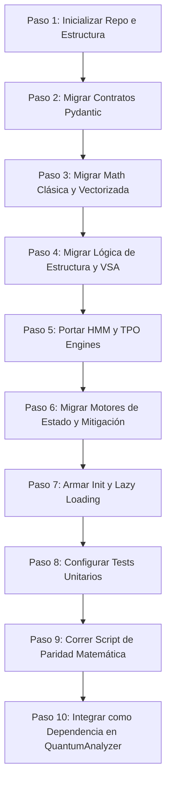

# Plan de Migración: Módulo Técnico y Microestructura

## 1. Resumen Ejecutivo

**Objetivo:** Extraer toda la suite de análisis técnico, Smart Money Concepts (SMC), Volume Spread Analysis (VSA), TPO (Time Price Opportunity), perfiles de volumen, dinámica del libro de órdenes (LOB) y regímenes ocultos de Markov (HMM) del monorepo `QuantumAnalyzer` y empaquetarlos como un repositorio independiente, ordenado y limpio llamado `technical-analysis-engine`.

**Capacidad que se habilita:** Un motor puramente cuantitativo y analítico capaz de calcular 40+ indicadores institucionales de estructura de mercado, momentum y microestructura, sin acoplamiento a clientes API, frameworks web (FastAPI) ni sistemas de persistencia complejos. Esta librería podrá importarse en cualquier bot de trading, terminal externa o backend de investigación quant.

---

## 2. Árbol Completo del Nuevo Repositorio (`technical-analysis-engine`)

El repositorio seguirá el estándar moderno de empaquetado estructurado bajo `src/`.

```
technical-analysis-engine/
├── pyproject.toml                       # Build system, metadatos y toolings (Ruff/Mypy)
├── requirements.txt                     # Dependencias estrictas
├── README.md                            # Guía de integración
├── .env.example                         # Configuración local de testings
│
├── src/
│   └── technical_analysis_engine/
│       ├── __init__.py                  # API pública del motor con importaciones diferidas (Lazy Loading)
│       │
│       ├── domain/                      # Modelos de Datos y Contratos (Pydantic V2)
│       │   ├── __init__.py
│       │   ├── confluence_models.py     # MicrostructureConfluenceResult, SMCResult, VSAResult, etc.
│       │   ├── avwap_models.py          # AVWAPBands, AVWAPResult
│       │   ├── fvg_models.py            # Candle, FVGZone, FVGAnalysisOutput, FVGEvent
│       │   ├── lob_models.py            # LOBLevel, LOBSnapshot, LOBDynamicsResult, OFIResult, CVDResult
│       │   ├── tpo_models.py            # TPOLevel, TPOProfile, TPOSkewnessSignal, TPOSkewnessConfig
│       │   └── volume_models.py         # DeltaVolumeProfile, VolumeProfileResult, VolumeNodeTopography
│       │
│       ├── math/                        # Librerías Matemáticas Stateless (NumPy/SciPy, sin IO)
│       │   ├── __init__.py
│       │   ├── technical.py             # SMA, EMA, SMMA, RSI, MACD, ATR, Bollinger, SuperTrend, VWAP, Entropy, AVWAP
│       │   ├── smc_math.py              # Detección de BOS/CHoCH, Order Blocks, Liquidity Sweeps
│       │   ├── vsa_math.py              # Clasificación de volumen, anomalías de absorción, Weis Wave
│       │   ├── tpo_math.py              # Fisher-Pearson skewness, bimodal checks, TPO binning
│       │   ├── lob_math.py              # Order Flow Imbalance (OFI), LOB Queue Imbalance, CVD
│       │   ├── hmm_math.py              # Gaussian HMM log forward filter, log-sum-exp, entropy risk
│       │   └── volume_profile_math.py   # POC, Value Area (VAH/VAL), High/Low Volume Nodes (HVN/LVN)
│       │
│       ├── engines/                     # Procesadores de Señal y Motores de Estado
│       │   ├── __init__.py
│       │   ├── fvg_engine.py            # Mitigación y ciclo de vida de Fair Value Gaps
│       │   ├── hmm_engine.py            # Inferencia online HMM (regímenes de mercado)
│       │   ├── lob_dynamics_engine.py   # LOB Dynamics Engine (flujo del libro)
│       │   ├── ofi_engine.py            # Order Flow Imbalance Engine
│       │   ├── tpo_skewness_engine.py   # Constructor y analizador de perfiles TPO
│       │   ├── smc_fractal_engine.py    # Detección de swing points y fractales
│       │   ├── vsa_footprint_engine.py  # VSA integrado con footprints de flujo
│       │   ├── volume_node_engine.py    # Clasificador de topografía de volumen
│       │   └── vpoc_migration_engine.py # Rastreador de migraciones de POC
│       │
│       └── config/
│           ├── __init__.py
│           └── logger_setup.py          # Logger standalone
│
├── tests/                               # Suite completa de tests
│   ├── __init__.py
│   ├── conftest.py
│   ├── test_technical.py
│   ├── test_smc.py
│   ├── test_vsa.py
│   ├── test_fvg.py
│   ├── test_tpo.py
│   ├── test_lob.py
│   ├── test_hmm.py
│   └── test_volume.py
│
├── scripts/
│   └── validate_technical_math.py       # Script de verificación de paridad numérica
│
└── examples/
    ├── 01_basic_indicators.py
    ├── 02_smc_structure_detection.py
    ├── 03_hmm_regime_classification.py
    └── 04_order_book_flow_analysis.py
```

### 2.1. Componentes que NO se migran (Se quedan en el backend principal)

| Componente | Razón de Exclusión |
|---|---|
| `tecnico/service.py` | Servicio de hidratación de snapshots. Está fuertemente acoplado a dependencias de base de datos local y llamadas a clientes externos. |
| `tecnico/snapshot.py` | Lógica de serialización y guardado de gráficos en el monorepo. |
| `tecnico/component.py` | Declaración de componentes de orquestación propia del monorepo. |
| `tecnico/polygon_models.py` | Modelos específicos de respuestas directas del API de Polygon. Pertenecen a la capa de ingesta de datos. |

---

## 3. Lógica Matemática y Fórmulas del Motor Técnico

A continuación se detallan las especificaciones matemáticas de cada sub-módulo para evitar bugs de traducción y asegurar una paridad del 100%.

### 3.1. Indicadores Técnicos Clásicos (`math/technical.py`)

#### Media Móvil Simple (SMA)
$$\text{SMA}_t = \frac{1}{n} \sum_{i=0}^{n-1} C_{t-i}$$
Implementada de manera vectorizada en $O(N)$ usando `np.cumsum` para optimizar velocidad.

#### Media Móvil Exponencial (EMA)
$$\text{EMA}_t = C_t \cdot k + \text{EMA}_{t-1} \cdot (1 - k) \quad \text{donde } k = \frac{2}{n + 1}$$
*Nota: Se inicializa con la media aritmética (`.mean()`) de los primeros $n$ valores válidos del array.*

#### Media Móvil Suavizada de Wilder (SMMA / Smoothed MA)
$$\text{SMMA}_t = \frac{\text{SMMA}_{t-1} \cdot (n - 1) + C_t}{n}$$

#### Relative Strength Index (RSI) corregido estilo Wilder
$$RS_t = \frac{\text{SMMA}_t(\text{Gains}, n)}{\text{SMMA}_t(\text{Losses}, n)}$$
$$\text{RSI}_t = 100.0 - \frac{100.0}{1.0 + RS_t}$$

#### Moving Average Convergence Divergence (MACD)
$$\text{MACD Line} = \text{EMA}(C, 12) - \text{EMA}(C, 26)$$
$$\text{Signal Line} = \text{EMA}(\text{MACD Line}, 9)$$
$$\text{Histogram} = \text{MACD Line} - \text{Signal Line}$$

#### Average True Range (ATR)
$$\text{TR}_t = \max\left(H_t - L_t, \, |H_t - C_{t-1}|, \, |L_t - C_{t-1}|\right)$$
$$\text{ATR}_t = \frac{\text{ATR}_{t-1} \cdot (n - 1) + \text{TR}_t}{n}$$

#### Shannon Entropy (Mide la aleatoriedad en el precio)
Sobre una ventana deslizante de longitud $n$:
$$H(X) = - \sum_{i=1}^{\text{bins}} p(x_i) \log_2 p(x_i)$$
*Donde $p(x_i)$ es la frecuencia relativa de observaciones en la partición (bining) de la ventana.*

#### Anchored VWAP (AVWAP)
Calcula el precio promedio ponderado por volumen anclado a un índice $t_0$ específico:
$$\text{AVWAP}_t = \frac{\sum_{i=t_0}^t \text{TP}_i \cdot V_i}{\sum_{i=t_0}^t V_i} \quad \text{donde } \text{TP}_i = \frac{H_i + L_i + C_i}{3}$$
Desviación estándar ponderada por volumen para bandas dinámicas:
$$\sigma_t = \sqrt{\frac{\sum_{i=t_0}^t V_i \cdot (\text{TP}_i - \text{AVWAP}_i)^2}{\sum_{i=t_0}^t V_i}}$$

---

### 3.2. Smart Money Concepts (SMC) (`math/smc_math.py`)

#### Identificación de Order Blocks (OB)
Se identifica una vela como Order Block institucional cuando hay un fuerte desequilibrio direccional (desplazamiento):
$$\text{Desplazamiento} = \frac{|C_{t+1} - O_{t+1}|}{\text{ATR}_t} \ge \delta \quad \text{donde } \delta \ge 1.3$$
- **BULLISH OB:** Vela bajista ($C_t < O_t$) seguida por una vela alcista fuerte ($C_{t+1} > H_t$) tal que el precio mínimo futuro se mantenga arriba del 50% del OB:
  $$\min(C_{t+1 \dots \infty}) \ge L_t + 0.5 \cdot (H_t - L_t)$$
- **BEARISH OB:** Vela alcista ($C_t > O_t$) seguida por una vela bajista fuerte ($C_{t+1} < L_t$) tal que el precio máximo futuro se mantenga debajo del 50% del OB.

#### Ruptura de Estructura (BOS / CHoCH)
Se valida una ruptura de estructura basándose en los pivotes oscilatorios (Swing Highs y Swing Lows):
- **BOS (Break of Structure):** Confirmación cuando el precio de cierre quiebra el pivote del mismo sesgo:
  $$C_i > \text{SwingHigh} \cdot 1.001$$
- **CHoCH (Change of Character):** Primer cambio de estructura que rompe la tendencia anterior (quiebre del Swing opuesto).

---

### 3.3. Volume Spread Analysis (VSA) (`math/vsa_math.py`)

#### Z-Score de Volumen ($V_z$)
$$V_z = \frac{V_t - \mu_V}{\sigma_V}$$
*Donde $\mu_V$ y $\sigma_V$ son la media y desviación estándar del volumen sobre una ventana (default 20).*

#### Índice de Absorción ($A_{\text{idx}}$) y Z-Score
$$A_{\text{idx}} = \frac{V_t}{(H_t - L_t) + \epsilon}$$
$$A_{\text{zscore}} = \frac{A_{\text{idx}} - \mu_A}{\sigma_A}$$
- **Absorción Anómala:** Ocurre cuando $A_{\text{idx}} > \mu_A + 2.0 \cdot \sigma_A$. Mide cuando un volumen extremo es absorbido en un rango estrecho de precio (típica firma de acumulación/distribución institucional).

#### Weis Wave Volume
Acumula el volumen en ondas unidireccionales basadas en cambios porcentuales de precio mayores a un umbral $\theta$:
$$\text{WaveVolume}_t = \begin{cases} 
\text{WaveVolume}_{t-1} + V_t & \text{si mantiene dirección de la onda} \\
V_t & \text{si cambia de tendencia} 
\end{cases}$$

---

### 3.4. TPO Profile y Skewness (`math/tpo_math.py`)

#### Clasificación Morfológica de Distribuciones TPO
Calcula la asimetría utilizando el coeficiente de Fisher-Pearson sobre los niveles de precio ponderados por el recuento de TPOs:
$$\text{Skewness} = \frac{\frac{1}{N}\sum_{i=1}^M \text{TPO}_i \cdot (P_i - \mu)^3}{\sigma^3}$$
- **PShape (Saturación arriba, cola abajo):** $\text{Skewness} < -0.50$.
- **BShape (Saturación abajo, cola arriba):** $\text{Skewness} > 0.50$.
- **NormalDistribution:** $|\text{Skewness}| \le 0.15$.
- **DDoubleDistribution (Bimodal):** Detectada cuando existen más de 6 ticks consecutivos con recuento de TPO $\le 1$ entre dos zonas densas.

---

### 3.5. Hidden Markov Model (HMM) (`math/hmm_math.py`)

#### Filtro Forward en Espacio Logarítmico (Gaussian Emission HMM)
Para evitar el underflow numérico, las probabilidades del filtro forward se calculan en escala logarítmica:
$$\log \alpha_t(j) = \log P(x_t \mid s_j) + \text{log-sum-exp}_{i} \left( \log \alpha_{t-1}(i) + \log A_{ij} \right)$$
*Donde $A_{ij}$ es la matriz de transición y $P(x_t \mid s_j)$ es la probabilidad de emisión gaussiana multivariada:*
$$\log P(x_t \mid s_j) = -0.5 \cdot (x_t - \mu_j)^T \Sigma_j^{-1} (x_t - \mu_j) - \left( \frac{d}{2}\log(2\pi) + 0.5\log|\Sigma_j| \right)$$

#### Entropía Normalizada del Estado (Riesgo de Transición)
$$H_t = -\frac{\sum_{j=1}^K p_j \log p_j}{\log K}$$
- **CRITICAL (Inestabilidad / Cambio de Régimen):** $H_t > 0.70$.
- **SHIFTING (Transición):** $H_t > 0.40$.
- **STABLE (Regímenes bien definidos):** $H_t \le 0.40$.

---

### 3.6. Volume Profile y VPOC Migration (`math/volume_profile_math.py`)

#### Value Area (VAH / VAL)
1. Encontrar el strike/precio con mayor volumen total (POC).
2. Sumar el volumen del POC.
3. Sumar recursivamente el volumen de los dos precios adyacentes de arriba y los dos de abajo con mayor volumen acumulado, hasta que la suma total sea al menos el 70% del volumen de la sesión.
4. El precio más alto dentro de este límite es la **Value Area High (VAH)**; el más bajo es la **Value Area Low (VAL)**.

---

## 4. Dependencias del Nuevo Repositorio (`requirements.txt`)

```txt
numpy>=1.26,<3
pandas>=2.0.0,<3
scipy>=1.10.0
pydantic>=2.5.0,<3
pandas-ta>=0.4.71b0                      # Requerido únicamente para algunos cálculos de TA
pytest>=8.0.0
pytest-cov>=4.1.0
```

*Nota: No se requiere SQLAlchemy, FastAPI, httpx, aiohttp ni bases de datos directas.*

---

## 5. Plan de Migración de 10 Pasos



### Paso 1: Inicializar repositorio y estructura
```bash
mkdir technical-analysis-engine && cd technical-analysis-engine
git init
mkdir -p src/technical_analysis_engine/{domain,math,engines,config}
mkdir -p tests examples
```

### Paso 2: Migrar Contratos Pydantic
Copiar los contratos desde `backend/layer_3_specialists/tecnico/confluence_models.py`, `avwap_models.py`, `fvg_engine.py` (modelos de datos), `lob_dynamics_engine.py` (modelos) y `tpo_skewness.py` (modelos).
Alinearlos a la estructura del nuevo paquete: `from technical_analysis_engine.domain...`.

### Paso 3: Migrar Matemática Clásica Vectorizada
Portar `technical.py` a `math/technical.py` y resolver dependencias de imports. Asegurar que las funciones NumPy funcionen sin dependencias del logger global del monorepo.

### Paso 4: Migrar Lógica de Estructura (SMC) y VSA
Portar `smc.py` y `vsa.py` a `math/smc_math.py` y `math/vsa_math.py` respectivamente.
Remover las importaciones relativas viejas y optimizar los bucles internos.

### Paso 5: Portar Motores HMM y TPO
Portar `hmm_engine.py` y `tpo_skewness.py` a `math/hmm_math.py` y `math/tpo_math.py`. Separar claramente los modelos Pydantic de la lógica matemática pura.

### Paso 6: Migrar Motores de Estado y Mitigación (`engines/`)
Copiar e integrar los archivos dinámicos:
- `fvg_engine.py` (clase `FVGEngine` encargada de trackear mitigaciones de Fair Value Gaps).
- `vwap_engine.py` / `avwap_models.py`.
- `lob_dynamics_engine.py` y `ofi_engine.py`.
- `volume_node_engine.py` y `vpoc_migration.py`.
- `smc_fractal_engine.py`.

### Paso 7: Crear el archivo `__init__.py` con Lazy Loading
Configurar la API pública de la biblioteca en `src/technical_analysis_engine/__init__.py` utilizando importaciones diferidas (`lazy loading`) para evitar la carga lenta y el consumo innecesario de memoria.

### Paso 8: Configurar Suite de Tests
Crear pruebas unitarias para cada indicador clásico y motores avanzados utilizando datos sintéticos (por ejemplo, ondas senoidales, caminatas aleatorias y arrays fijos).

### Paso 9: Crear y ejecutar Script de Validación de Paridad
Escribir `scripts/validate_technical_math.py` para cargar un dataset de prueba fijo (OHLCV histórico), procesarlo a través del nuevo motor y del antiguo, asegurando paridad del 100% en los decimales calculados.

### Paso 10: Integración en `QuantumAnalyzer`
Instalar el nuevo paquete en modo desarrollo en `QuantumAnalyzer` y actualizar las importaciones en `backend/routers/technical_router.py` y el pipeline orquestador. Eliminar las carpetas locales redundantes.

---

## 6. Prompt de Limpieza y Refactorización (Clean-up Prompt)

Utiliza el siguiente prompt con tu asistente de codificación de IA para refactorizar de manera segura cada componente antes de moverlo al repositorio independiente.

```markdown
PROMPT DE LIMPIEZA DE CÓDIGO - MOTOR ANÁLISIS TÉCNICO Y MICROESTRUCTURA

Actúa como un Ingeniero de Software Quant Senior. Tu tarea es refactorizar y limpiar el código del módulo técnico para que pueda funcionar de forma 100% desacoplada en el nuevo repositorio 'technical-analysis-engine'.

Aplica las siguientes reglas estrictas de desarrollo y refactorización:

1. REMOCIÓN DE CÓDIGO SPAGHETTI Y ACOPLAMIENTO:
   - Elimina cualquier importación que apunte al monorepo principal (como 'backend.*', 'config.settings', 'FMPClient', etc.).
   - Actualiza los imports al nuevo paquete local, por ejemplo:
     * 'from technical_analysis_engine.domain... import ...'
     * 'from technical_analysis_engine.math... import ...'
   - El código debe funcionar 100% en memoria a partir de argumentos inyectados (np.ndarray o pd.DataFrame normalizados). No permitas llamadas directas a red ni lecturas locales de disco en el core del motor.

2. STANDALONE LOGGER:
   - Reemplaza importaciones de logger heredadas por el logger estándar de Python:
     'import logging'
     'logger = logging.getLogger(__name__)'

3. COMPATIBILIDAD NUMPY 2.X Y ESTABILIDAD MATEMÁTICA:
   - Evita funciones de NumPy en proceso de depreciación. Específicamente, reemplaza 'np.trapz' por 'np.trapezoid' para la integración numérica, manteniendo un fallback seguro:
     ```python
     def _trapz1d(y, x=None):
         fn = getattr(np, "trapezoid", None)
         if fn is not None:
             return float(fn(y, x=x))
         return float(np.trapz(y, x))
     ```
   - Agrega regularización con constantes muy pequeñas (p. ej., '_EPS = 1e-12') en todas las divisiones de osciladores, medias ponderadas y z-scores para evitar errores numéricos de división por cero.
   - Agrega protección de desbordamiento exponencial (overflow) en cálculos del HMM y probabilidades de sweeps.

4. COMPATIBILIDAD PYDANTIC V2:
   - Asegura que todos los modelos de datos utilicen la sintaxis nativa de Pydantic V2 ('model_config = ConfigDict(...)', 'model_dump()', etc.).

5. PRESERVACIÓN DE DOCSTRINGS Y COMENTARIOS CLAVE:
   - Mantén los comentarios explicativos de la lógica del mercado, Weis Wave, algoritmos de Tom Williams, etc.
   - Elimina marcas de comentarios temporales o secciones del tipo '# MIGRATION AUDIT'.

Procesa el archivo y devuelve únicamente la implementación refactorizada, tipada con type hints y optimizada en rendimiento.
```

---

## 7. Verificación Post-Migración

Para validar el nuevo repositorio independiente:

1. **Instalación local:**
   ```bash
   pip install -e .
   ```
2. **Ejecutar tests unitarios:**
   ```bash
   pytest tests/ -v --cov=src/technical_analysis_engine
   ```
3. **Control de Estilo y Tipado:**
   ```bash
   mypy src/
   ruff check src/
   ```
